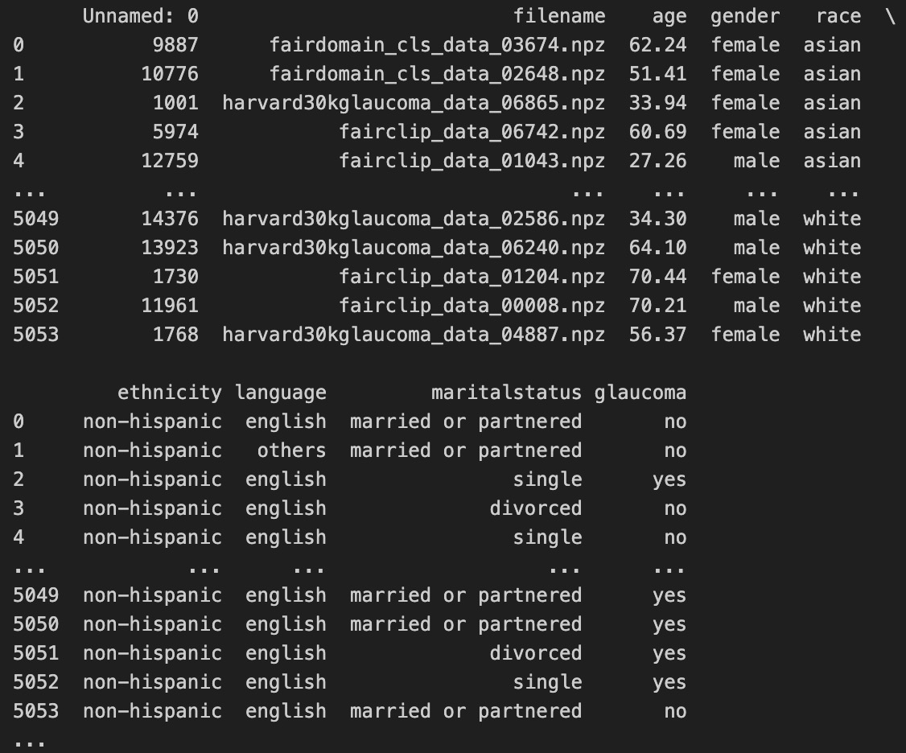
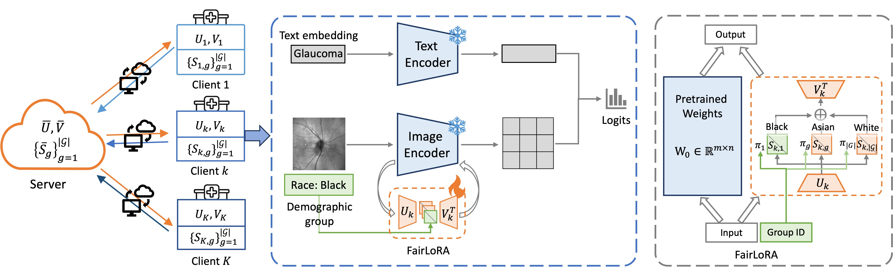

## Dataset (FairFedMed)
[Google Drive](https://drive.google.com/drive/folders/15dLIXpuwprnZ_NcDOXFnAWxcJvm1RPdD)

- **FairFedMed**
  - `all`  # a dir that stores all raw data files
  - `meta_all.csv`
  - `meta_site{k}_language_train.csv`
  - `meta_site{k}_language_test.csv`
  - `meta_site{k}_race_train.csv`
  - `meta_site{k}_race_test.csv`
  - `meta_site{k}_ethnicity_train.csv`
  - `meta_site{k}_ethnicity_test.csv`

- **Data format**



- **Attributes**
  - Race: [Asian, Black, White]
  - Language: [English, Spanish, Others, Unkown]
  - Ethnicity: [Non-hispanic, Hispanic, Unkown]

  Race: 
  - Site1: {'asian': 404, 'black': 758, 'white': 3892}
  - Site2: {'asian': 606, 'black': 1011, 'white': 3437}
  - Site3: {'asian': 268, 'black': 462, 'white': 4327}

  - Site1_test: 
    - {'asian': 39, 'white': 890, 'black': 83}
    - {'asian': {24, 15}, 'white': {404, 486}, 'black': {56, 27}} % label ratio: {'no', 'yes'} 

  Language: 
  - Site1: {'spanish': 50, 'unknown': 101, 'others': 202, 'english': 4701}
  - Site2: {'spanish': 151, 'unknown': 101, 'others': 303, 'english': 4498}
  - Site3: {'spanish': 47, 'unknown': 80, 'others': 102, 'english': 4829}

  - Site1_test:
    - {'others': 19, 'spanish': 10, 'english': 964, 'unknown': 19}
    - {'others': {13, 6}, 'spanish': {4, 6}, 'english': {453, 511}, 'unknown': {16, 3}}

## Methodology [(FairLoRA)](trainers/GLP_OT_SVLoRA.py)
Overview of fairness-aware federated learning model: FairLoRA, where singular value matrices are customized for each demographic group, such as ‘Black’, ‘Asian’, ‘White’.



## [Evaluation metrics](evaluation)
 - AUC
 - ESAUC
 - Group-wise AUC

## [Training]()
```
# 2D SLO images
sh scripts/fairlora_fairfedmed.sh      
# 3D OCT B-Scan images
sh scripts/fairlora_fairfedmed_oct.sh
```

## Acknowledge
This code is partially derived from the [FedOTP](https://github.com/HongxiaLee/FedOTP) and [DASSL](https://github.com/KaiyangZhou/Dassl.pytorch) frameworks. Thanks!
